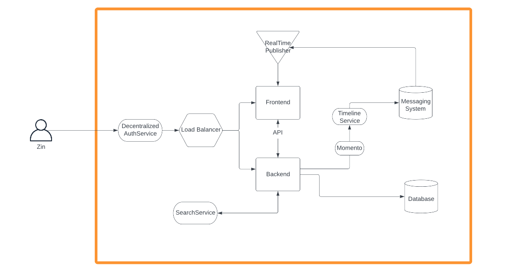
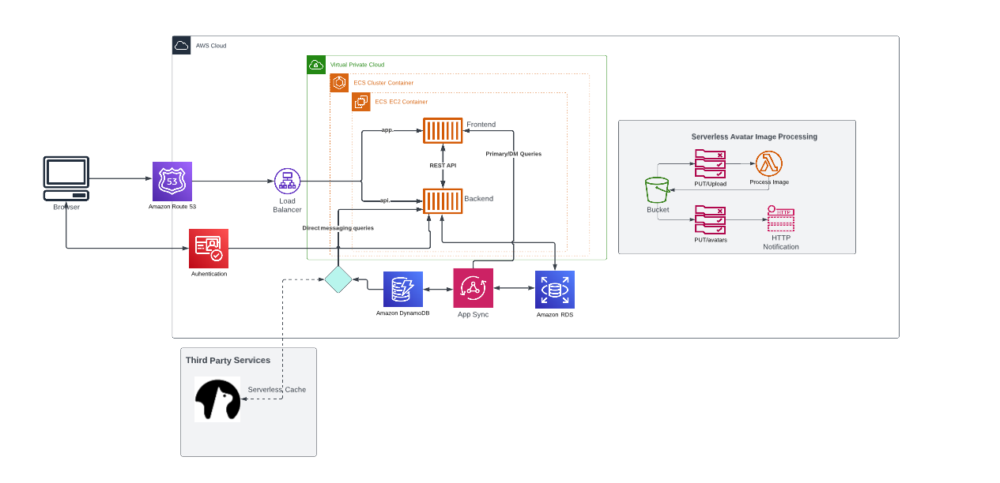
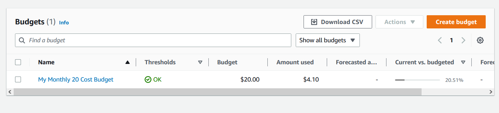
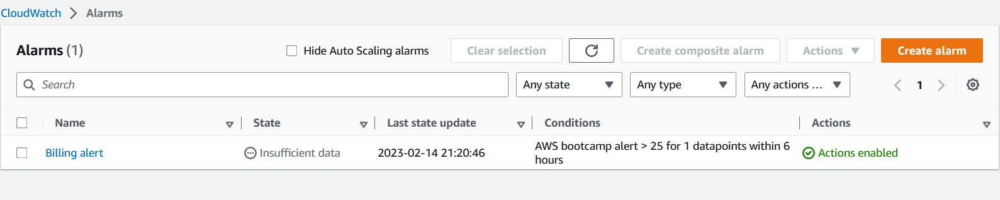
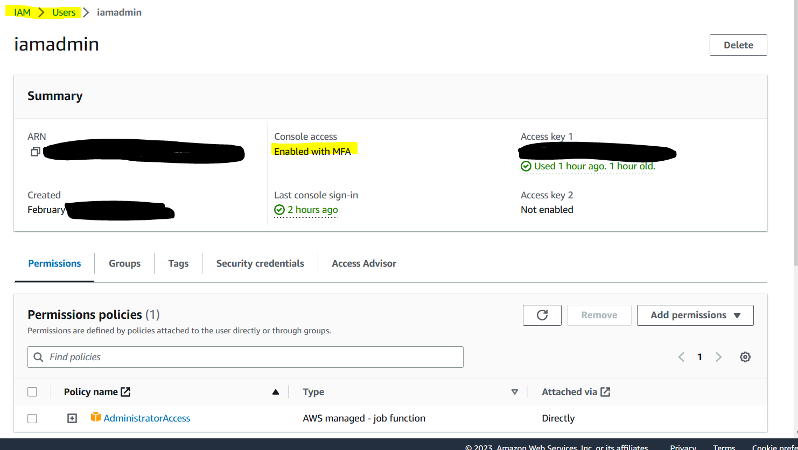

# Week 0 — Billing and Architecture

## Required Homework

### Conceptual Diagram - https://lucid.app/lucidchart/invitations/accept/inv_ca1881e1-a497-46a8-bd37-578998f8dcf8

### Logical Diagram - https://lucid.app/lucidchart/invitations/accept/inv_ca1881e1-a497-46a8-bd37-578998f8dcf8

### Created Admin User

### Used CloudShell

### Generated Credentials

### Installed AWS CLI

### Created Budget

### Created Alarm

## Homework Challenges

#### Destroy your root account credentials, Set MFA, IAM role

