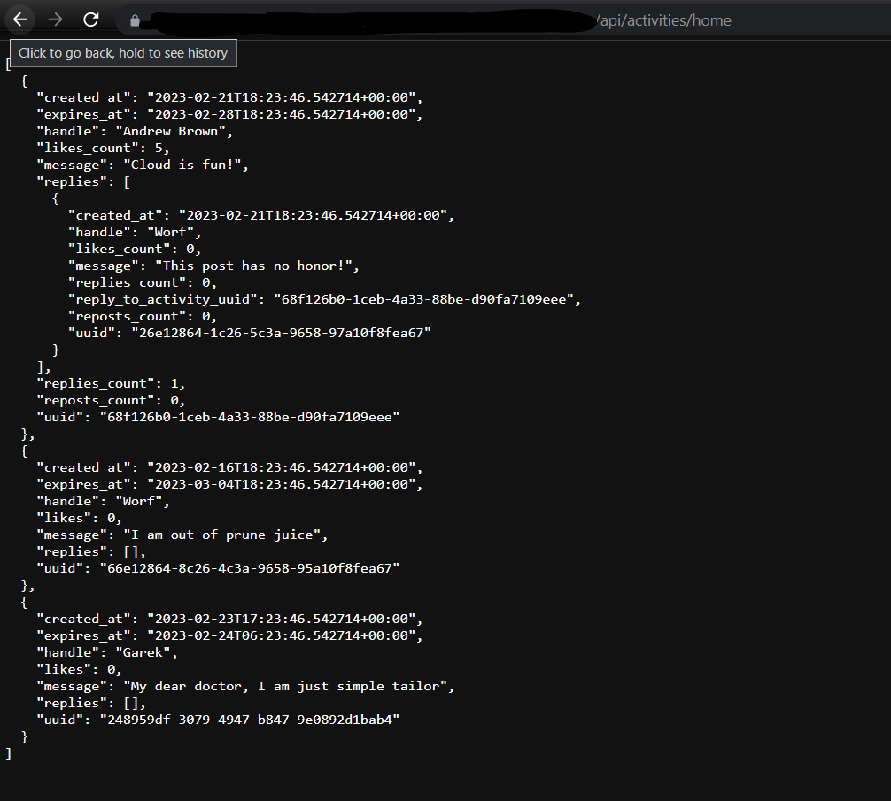
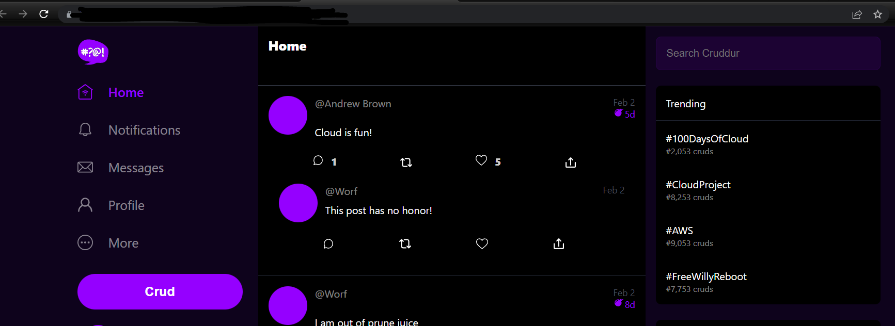
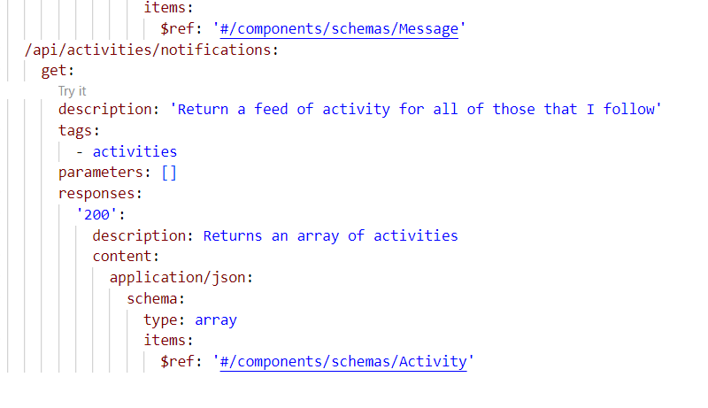
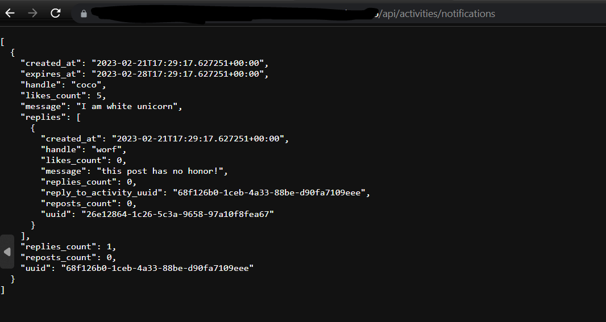
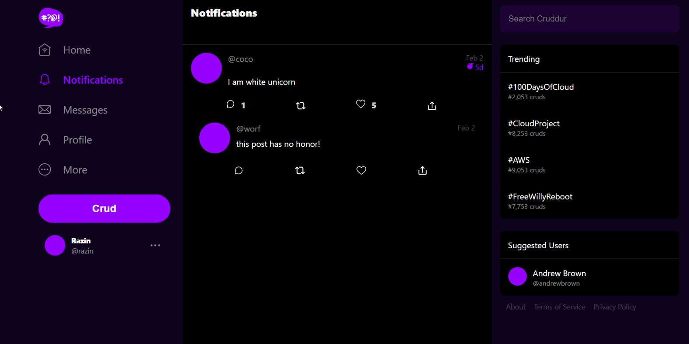
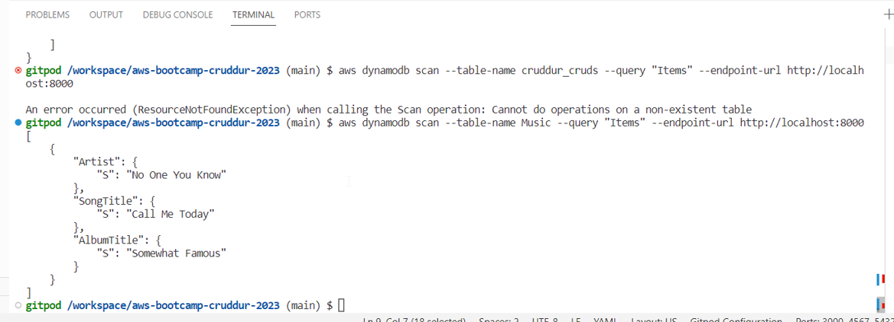
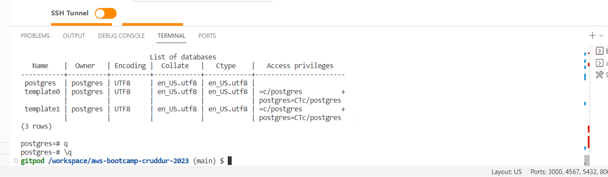

# Week 1 — App Containerization

### Succesfully containerized Application using Dockerfiles and confirmed app is up and running on both backend as well frontend side using Docker Up command 

### Documented Notification endpoint for OpenAPi Document

### Completed backend endpoint and attached it to frontend for Notification module.

### Installed and tested DynamoDB and Postgres

