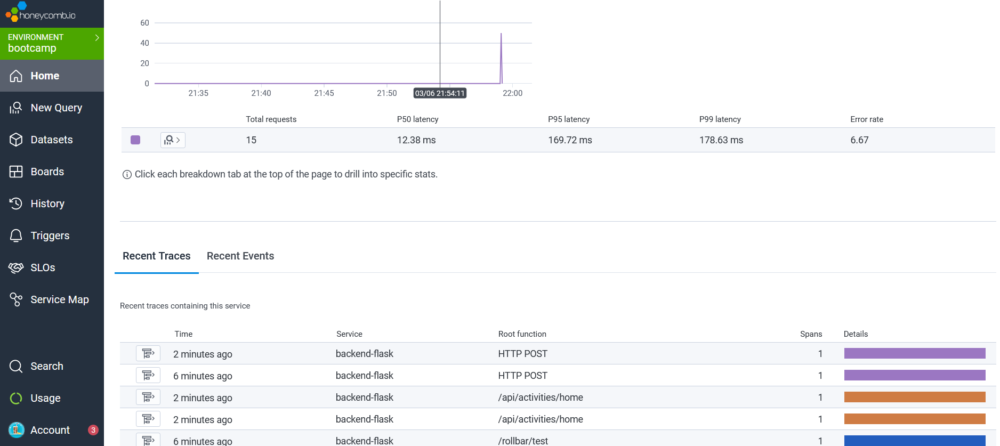
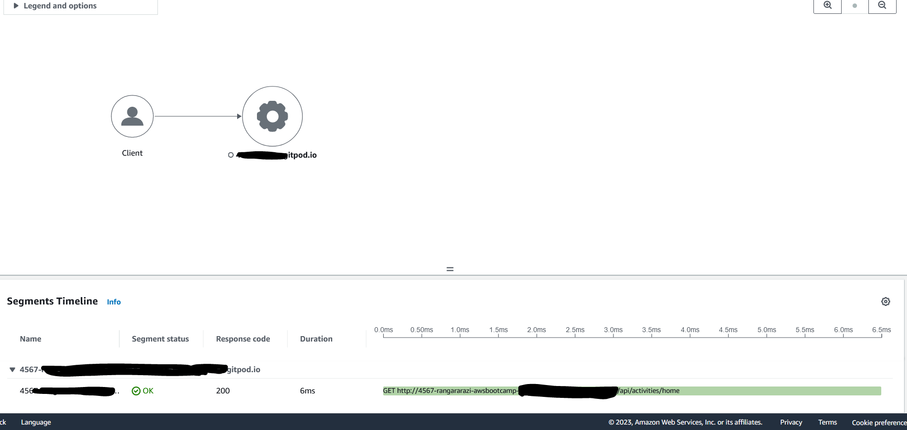
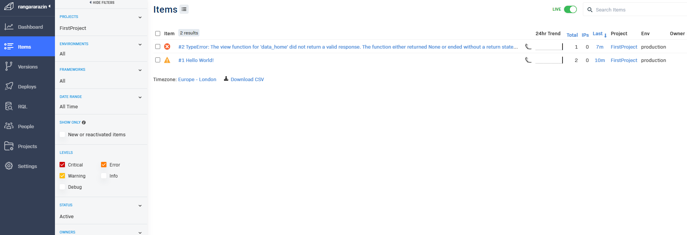
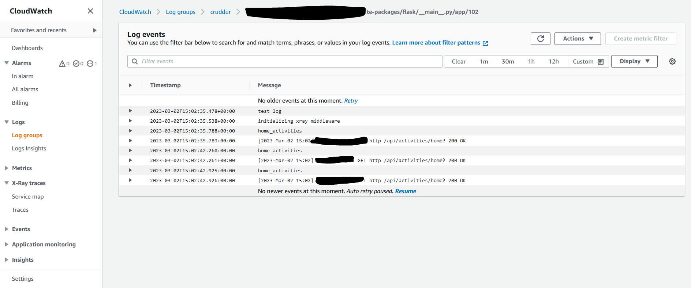

# Week 2 — Distributed Tracing

## Required Homework

### Instrument our backend flask application to use Open Telemetry (OTEL) with 
#### Honeycomb.io as the provider
#### Run queries to explore traces within Honeycomb.io

### Instrument AWS X-Ray into backend flask application
#### Configure and provision X-Ray daemon within docker-compose and send data back to X-Ray API

### Integrate Rollbar for Error Logging
#### Trigger an error an observe an error with Rollbar

### Install WatchTower and write a custom logger to send application log data to - CloudWatch Log group

