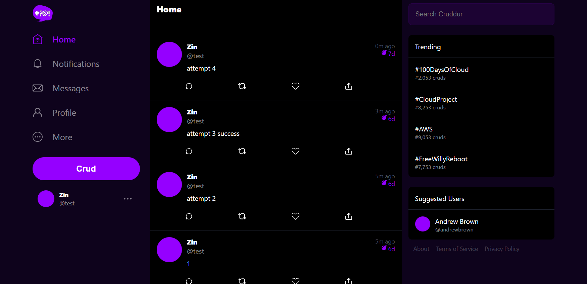

# Week 4 — Postgres and RDS
#### NOTE -  As per latest grading will try to start journaling in details if time permits.

## Required Homework

### Provision an RDS instance

### Created Lambda fucntion and sccuessfully executed it

### Most important part of this week was craeting activity and posting CRUD

